# NanoClaw vs OpenClaw — Deep Architecture Comparison

> Diagrams use [Mermaid](https://mermaid.live) — paste any block into mermaid.live to render interactively.

---

## 1. Top-Level Philosophy

| Dimension | NanoClaw | OpenClaw |
|-----------|----------|----------|
| Core premise | Agent is dangerous, must be caged | Agent is powerful, must be orchestrated |
| Codebase size | ~4,000 lines (intentional) | Enterprise monorepo, 100k+ lines |
| Security model | OS-level / hardware isolation | Application-layer + operator trust |
| Extensibility | Static code transformation | Runtime plugin registry (ClawHub) |
| Deployment target | Single-user, security-critical | Teams, cloud, Kubernetes |
| Stars / adoption | Niche, growing | 215,000+ stars |
| License | — | MIT |

---

## 2. High-Level Architecture

### NanoClaw

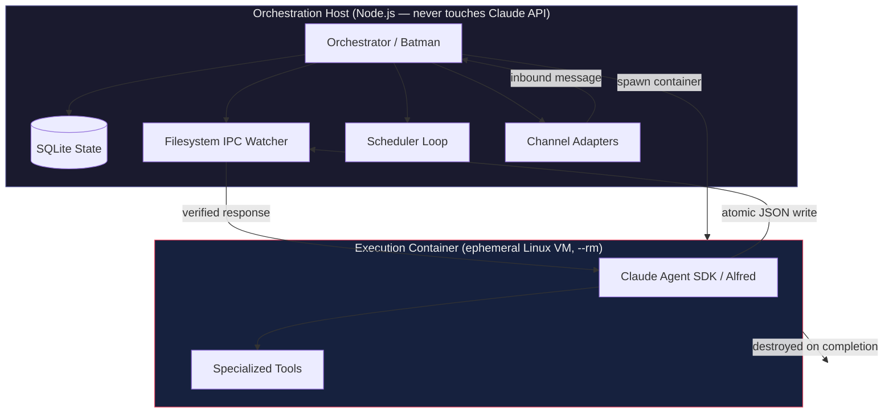

### OpenClaw

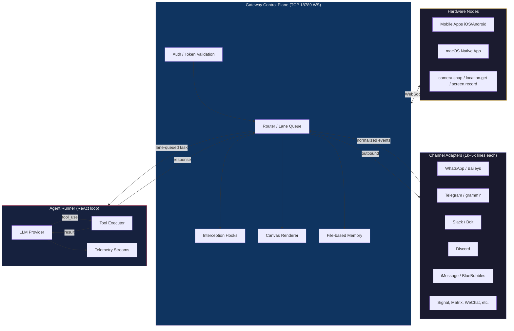

---

## 3. Security Architecture

### NanoClaw — Defense in Depth (OS-level)

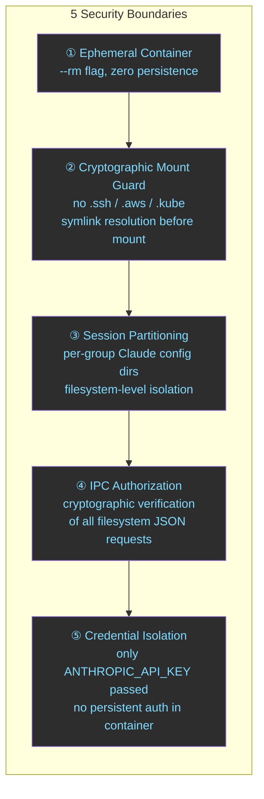

### OpenClaw — Application-Layer Trust Model

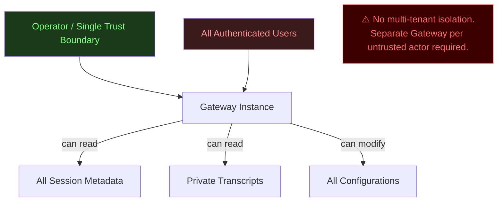

### Vulnerability Comparison

| Attack Surface | NanoClaw | OpenClaw |
|---------------|----------|----------|
| Prompt injection → host escape | Blocked by VM boundary | Application-layer mitigations only |
| Cross-session data leak | Blocked by filesystem partitioning | Possible — single trust boundary |
| Credential exposure in container | Only API key, no persistent auth | Configurable, defaults vary |
| Network attack surface | None — containers have no network stack | TCP/18789 WebSocket, loopback default |
| Supply chain (skills) | Static merge, no runtime exec of skill code | 7.1% of ClawHub skills mishandle secrets; 283–341 confirmed credential stealers |
| Multi-tenant | Not supported (by design — single user) | Not supported (explicit doc disclaimer) |
| Memory accumulation (CWE-770) | N/A | Known bug in `command-queue.ts` — LaneState Map never cleaned, causes OOM |
| WebSocket hijacking | N/A | Session fixation via CSRF → persistent bidirectional access |
| Network misconfiguration | N/A | 0.0.0.0 binding → RCE within minutes of public exposure |

---

## 4. Inter-Process Communication

### NanoClaw — Filesystem IPC

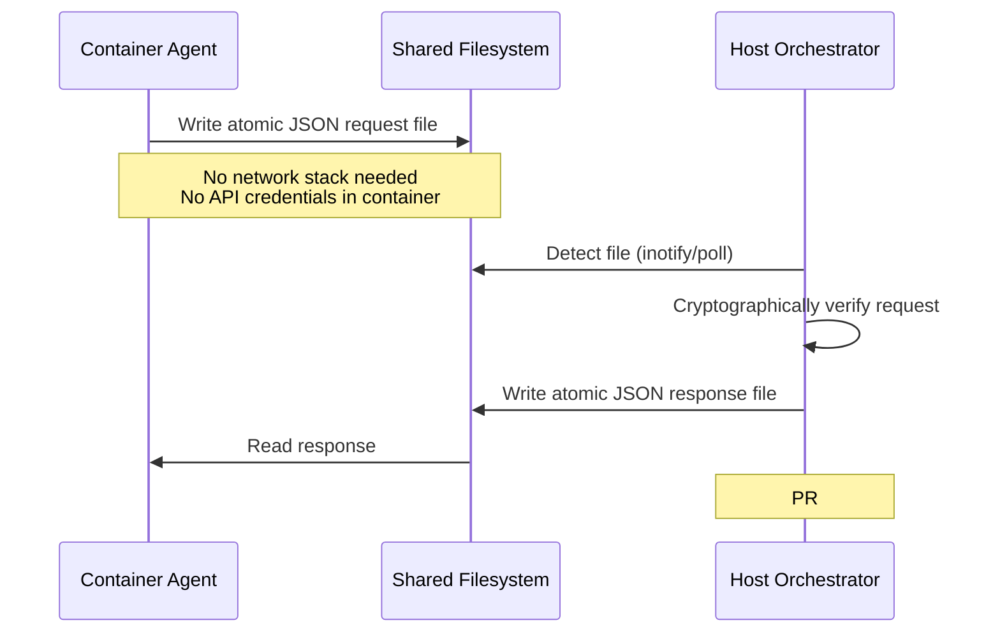

**Properties:**
- Zero network exposure inside container
- Atomic writes prevent stream injection
- Request forgery blocked by crypto verification
- Host never writes back without verification

### OpenClaw — WebSocket Transport

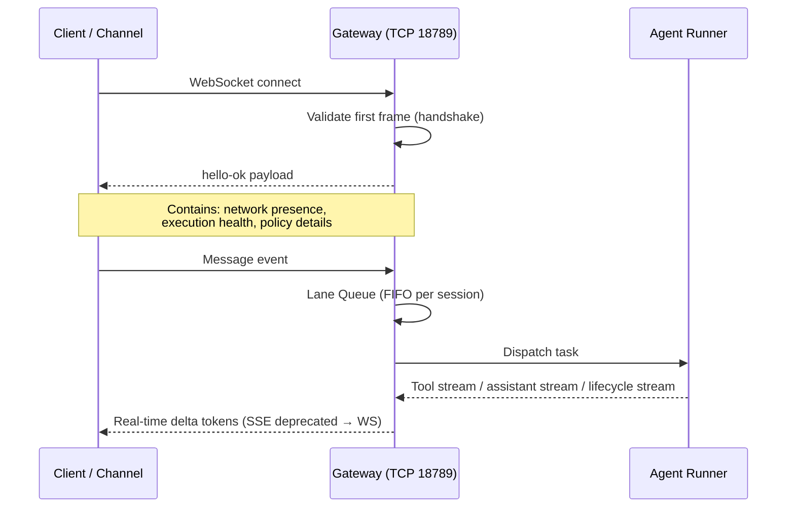

**Properties:**
- Bidirectional, real-time
- Strict FIFO per lane prevents race conditions
- Unencrypted by default — TLS is operator responsibility
- Session fixation risk on hijack

---

## 5. Memory Architecture

### NanoClaw — Three-Layer Memory

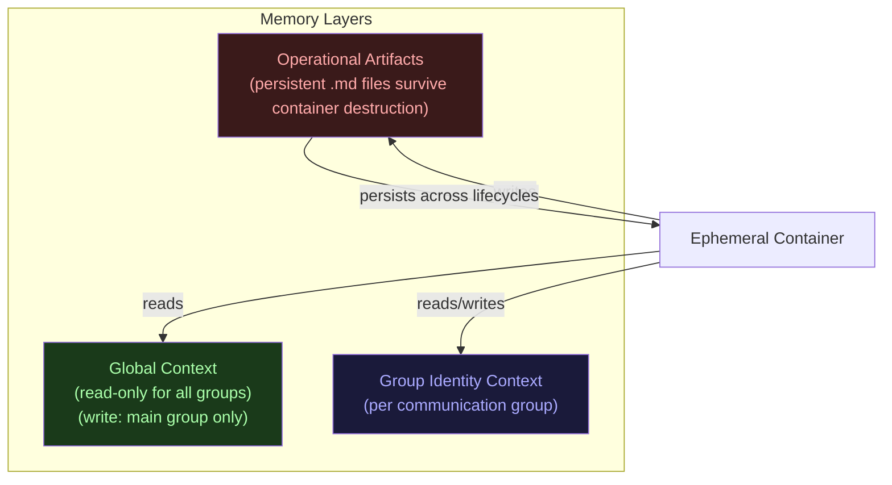

### OpenClaw — File-Based Markdown Memory

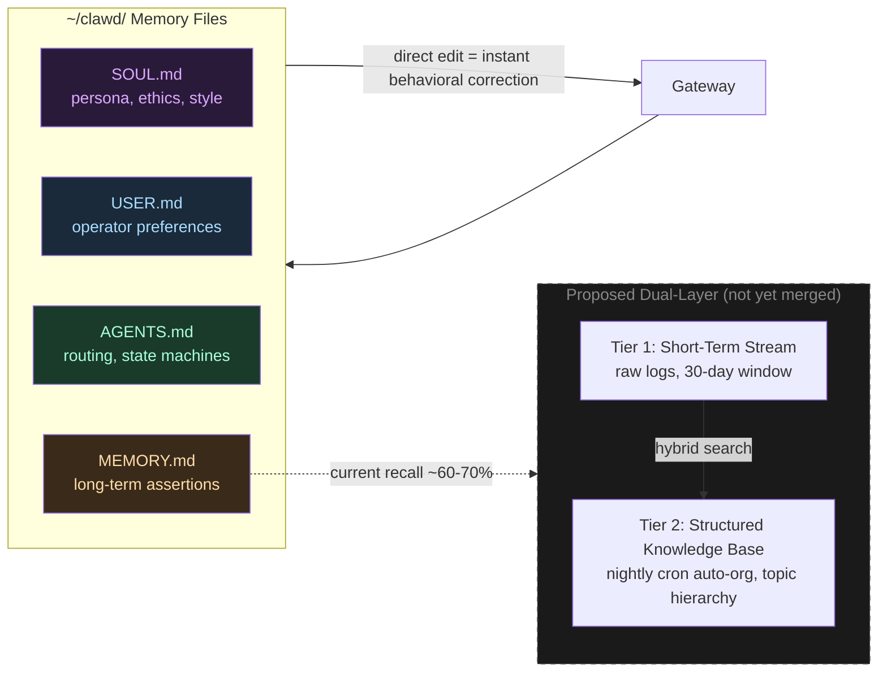

---

## 6. Extensibility / Skills Engine

### NanoClaw — Static Code Transformation

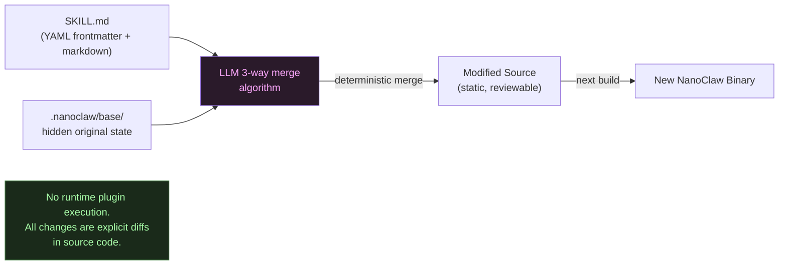

**Key properties:**
- Skills are merged *into* the codebase, not loaded at runtime
- Every integration is an auditable source diff
- Codebase stays small (skills don't accumulate as runtime deps)
- Follows Anthropic Agent Skills open standard

### OpenClaw — Runtime Plugin Registry (ClawHub)

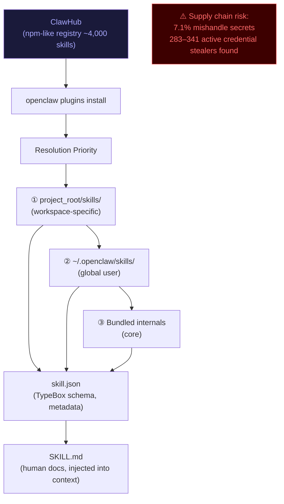

---

## 7. Deployment Models

### NanoClaw

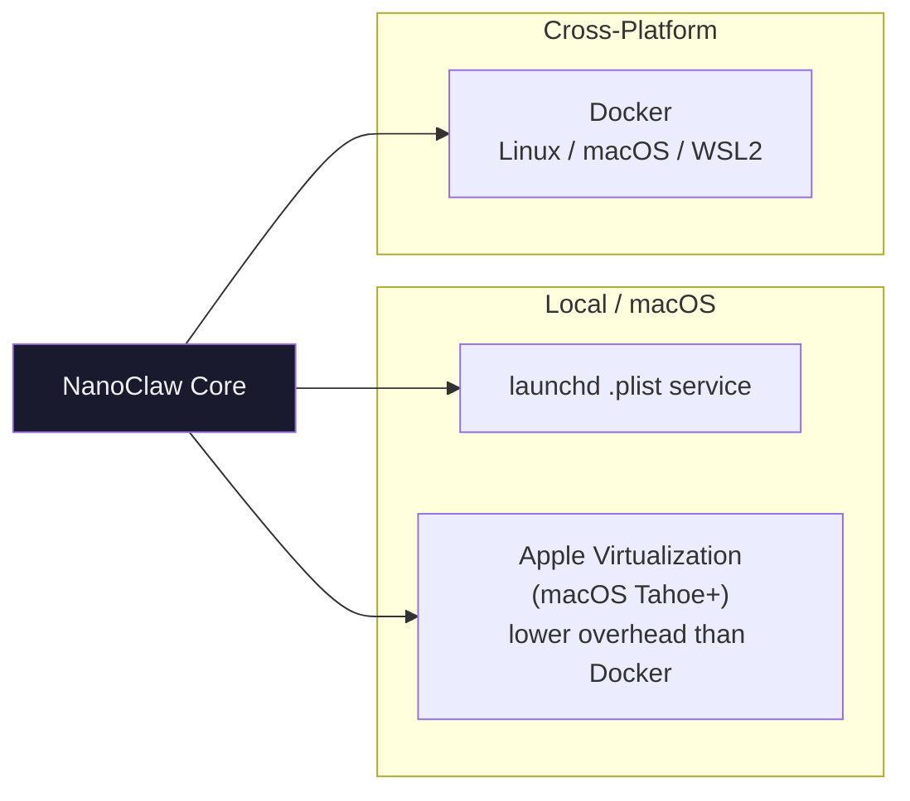

### OpenClaw

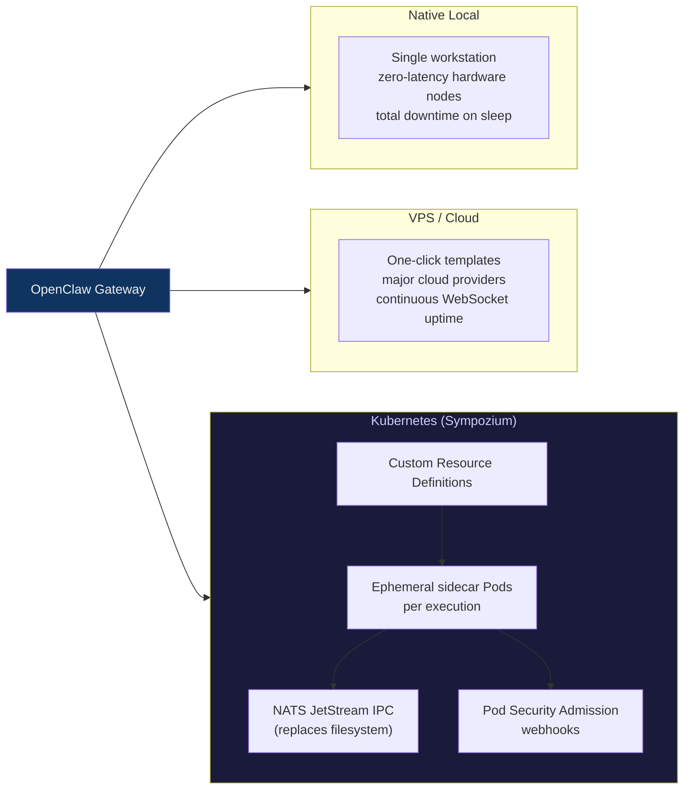

---

## 8. Channel Support (Current + In-Flight PRs)

| Channel | NanoClaw | OpenClaw |
|---------|----------|----------|
| Telegram | ✅ core | ✅ core |
| Slack | ✅ core | ✅ core |
| Discord | ✅ skill | ✅ extension |
| WhatsApp | ✅ skill | ✅ Baileys |
| Signal | ✅ skill (PRs #784, #665) | ✅ extension |
| iMessage | — | ✅ BlueBubbles |
| Feishu / Lark | ✅ skills (3 PRs) | ✅ heavy (6+ PRs) |
| Matrix | ✅ PR #791 | — |
| Mattermost | ✅ PR #546 | ✅ extension |
| Google Chat | ✅ PR #752 | — |
| QQ / NapCat | ✅ PRs #821, #796 | — |
| WeChat Work | — | ✅ PR #39511 |
| DingTalk | ✅ PR #764 | — |
| Web Chat (browser) | ✅ PR #797 | ✅ core web-ui |
| IMAP Email | — | ✅ PR #39625 |
| CLI | ✅ PR #680 | ✅ core |
| Hardware nodes (camera/location) | ❌ | ✅ core |

---

## 9. AI Provider Support

| Provider | NanoClaw | OpenClaw |
|----------|----------|----------|
| Anthropic Claude | ✅ primary | ✅ |
| Ollama (local) | ✅ PR #797 | ✅ |
| llama.cpp | ✅ PR #762 | — |
| Generic LLM / OpenAI-compat | ✅ PR #557 | ✅ |
| Azure OpenAI | — | ✅ PR #39540 |
| Codex | ✅ PR #572 | — |
| Novita AI | — | ✅ PR #39675 |
| GitHub Copilot models | — | ✅ PR #39613 |
| Moonshot / Kimi | — | ✅ |

---

## 10. Concurrency Model

### NanoClaw

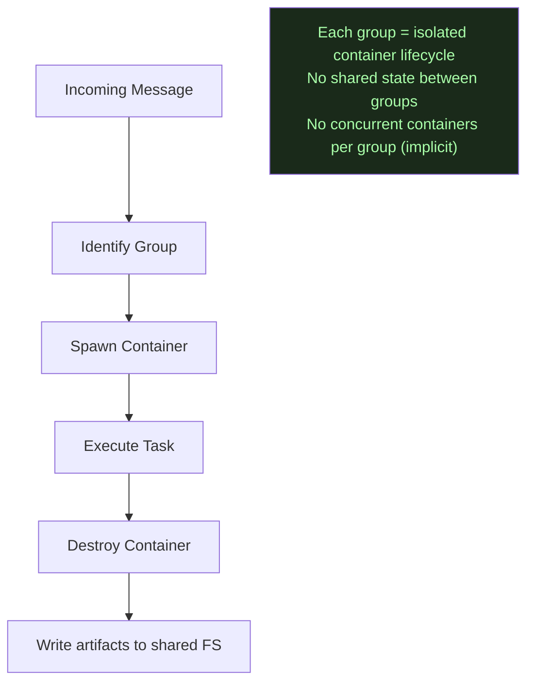

### OpenClaw — Lane Queue (Default Serial, Explicit Parallel)

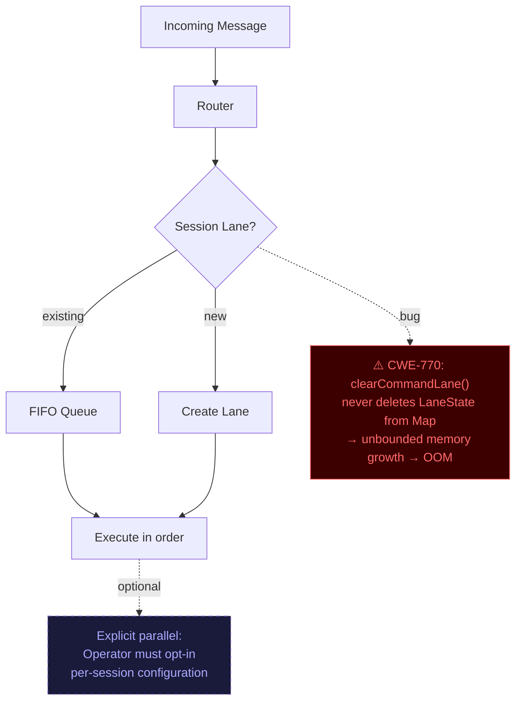

---

## 11. What's Actually Different — Summary Matrix

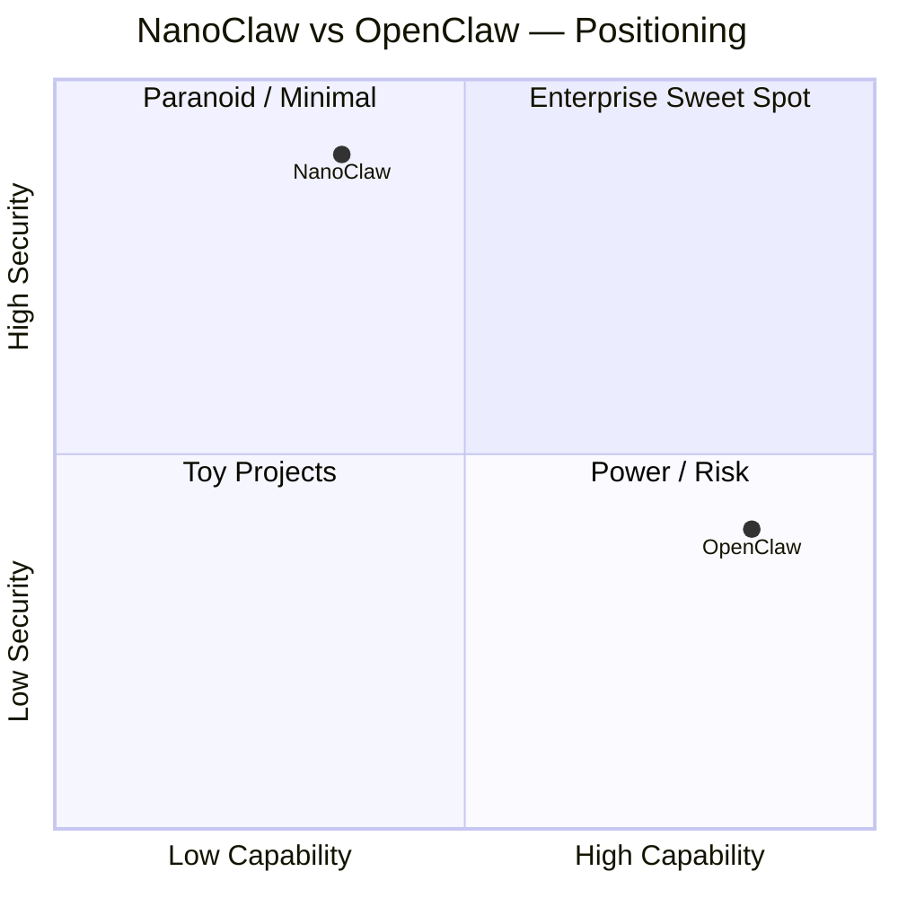

| Concern | NanoClaw wins | OpenClaw wins |
|---------|--------------|--------------|
| Security isolation | ✅ OS-level, provable | |
| Attack surface | ✅ Minimal, auditable | |
| Channel breadth | | ✅ More native integrations |
| Hardware node support | | ✅ Camera, location, screen |
| Kubernetes / cloud scale | | ✅ Sympozium |
| AI provider variety | | ✅ More providers |
| Community size | | ✅ 215k stars |
| Codebase auditability | ✅ 4k lines, LLM-readable | |
| Skill supply chain safety | ✅ Static merge, no runtime exec | |
| Memory debuggability | ✅ Filesystem + SQLite | ✅ Markdown edit = instant fix |
| Real-time streaming | Filesystem-based (lower latency risk) | ✅ WebSocket, SSE |
| Mobile apps | ❌ | ✅ iOS + Android |
| Canvas / visual workspace | ❌ | ✅ HTML/CSS/JS agent-driven |
| Multi-tenant safety | ❌ (both fail, NanoClaw by design) | ❌ (explicit disclaimer) |

---

## 12. Active Development Signals (from open PRs)

### NanoClaw (open PR analysis)
- **IPC rewrite** (#816) — moving to JSON-RPC 2.0 over stdio (architectural shift away from filesystem IPC)
- **Web Chat UI** (#797) — 77k line PR adding browser channel, Cloudflare tunnel, Ollama, Airtable
- **Memory system** (#560/#561) — RAG-based semantic memory being added
- **New channels flood** — QQ, WeChat Work via NapCat, Matrix, Mattermost, Google Chat

### OpenClaw (open PR analysis)
- **Feishu mega-PR** (#39496) — 9 streaming bug fixes, 3-layer dedup, calendar CRUD tools
- **IMAP hook** (#39625) — email without Gmail dependency
- **Azure OpenAI + Novita** — provider expansion
- **Wecom channel** (#39511) — WeChat Work already on npm, requesting inclusion
- **Per-agent timezone** (#39610) — cross-cutting config quality-of-life
- **Dual-layer memory** — proposed upgrade from ~65% to higher recall (not yet in PR)

---

> **Bottom line:** NanoClaw is being pushed toward richer features (web UI, RAG memory, more channels) while trying to maintain its security-first identity. OpenClaw is maturing its core (fixing IPC bugs, better memory, provider breadth). The gap in security model is structural — NanoClaw's container boundary is a design constraint that OpenClaw doesn't share and can't easily retrofit.
